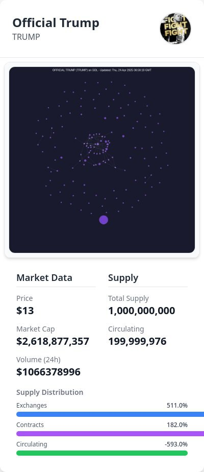

# Case Study: TRUMP Meme Coin - A Risky Venture

## Overview
The **TRUMP** meme coin, branded as "Official Trump," launched on Solana, leveraging political hype with a total supply of **1,000,000,000 tokens**. As of April 30, 2025, it trades at **$13**, with a market cap of **$2,618,877,357** and a 24-hour trading volume of **$1,066,378,996**. Despite a circulating supply of **199,999,976 tokens**, its distribution raises red flags.

## The Risk: Supply Concentration
A massive **82% of TRUMP's circulating supply** is held in a single cluster, fully unlocked and ready to sell. This concentration risks a price crash if the holders—possibly insiders—dump their tokens. The supply breakdown shows **51.1%** on exchanges, **18.2%** in contracts, and a confusing **-593.0%** circulating supply, suggesting a data error or misrepresentation.

## Market Implications
TRUMP's high volume and market cap indicate strong interest, but the concentrated supply is a ticking time bomb. A sudden sell-off could devastate retail investors drawn by hype. The **-593.0%** circulating supply figure may inflate the market cap, misleading investors about the token's stability.

## Impact on Solana
As a Solana-based token, TRUMP's risks could damage the ecosystem's reputation. Solana's appeal for meme coins depends on trust, but such high-risk projects may deter investors, highlighting the need for better oversight to flag problematic tokenomics.

## Visual Reference

## Conclusion
TRUMP's $2.6 billion market cap masks dangers, with 82% of its supply in one cluster and a dubious **-593.0%** circulating supply metric. Investors must prioritize due diligence, and Solana needs tools to spot such risks. This case highlights the volatility of meme coins and the need for transparency.
