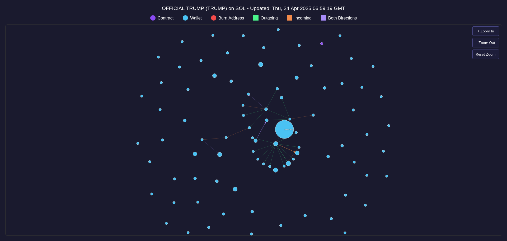

# Case Study: Analyzing the Transaction Network of the OFFICIAL TRUMP (TRUMP) Token on Solana

The OFFICIAL TRUMP (TRUMP) token on the Solana blockchain presents an intriguing case of token distribution and interaction among wallets. Visualized in the network graph above, the ecosystem displays a clear hub-and-spoke structure, with one dominant wallet at the center interacting heavily with many smaller wallets. Each node in the graph represents a wallet or contract, and the size of each node correlates with the volume of activity, providing insight into the token's flow and centralization tendencies.

At the core of the graph, a significantly larger node highlights a wallet that acts as the primary distributor or holder of TRUMP tokens. This wallet has multiple outgoing connections, shown by green lines, indicating the transfer of tokens to numerous other wallets. The surrounding wallets are mostly isolated beyond their initial interaction, suggesting that many participants either received tokens without further transactions or are long-term holders. This kind of distribution pattern can indicate initial airdrops, early-stage token distribution, or centralized liquidity control.

Interestingly, there is a relatively low number of burn addresses (marked in red), which hints that token burning has not been a major component of the TRUMP token's lifecycle thus far. Additionally, the sparse bidirectional transactions (indicated by purple lines) imply that peer-to-peer trading among users is limited, concentrating most transactional power within the central wallet. This structure raises questions about decentralization and liquidity mobility within the TRUMP token community, issues that are critical for token growth and long-term trust.

The visualization also shows a highly dispersed set of outer wallets that have little or no further connections, hinting at low active trading behavior. These isolated nodes might represent holders who have either staked their tokens, forgotten about them, or are speculating on long-term value increases without participating in the ecosystem actively. The limited incoming (orange lines) and outgoing (green lines) interactions further reinforce the impression of a mostly static or early-stage token economy.

In conclusion, the OFFICIAL TRUMP (TRUMP) token network on Solana currently exhibits strong centralization around a single wallet with relatively minimal secondary market activity. While this might be typical for newer tokens or marketing campaigns, it suggests that for TRUMP to grow into a more vibrant and trusted ecosystem, it will need to foster more organic peer-to-peer activity, decentralize its holdings, and encourage wider transaction behavior among token holders. Future monitoring of this graph could provide valuable insights into the token's maturation and the effectiveness of its community engagement strategies.
